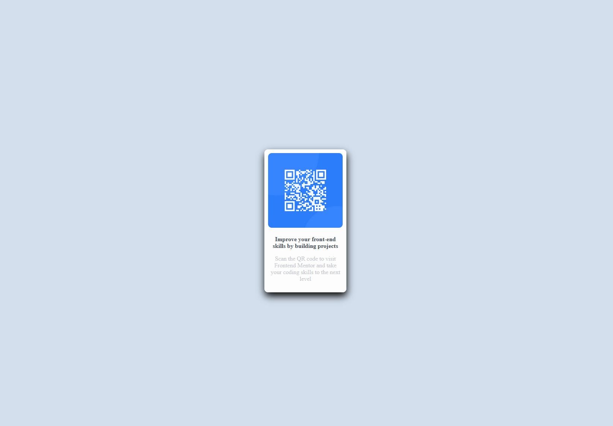

# Frontend Mentor - QR code component solution

This is a solution to the [QR code component challenge on Frontend Mentor](https://www.frontendmentor.io/challenges/qr-code-component-iux_sIO_H). Frontend Mentor challenges help you improve your coding skills by building realistic projects. 

## Table of contents

- [Overview](#overview)
  - [Screenshot](#screenshot)
  - [Links](#links)
- [My process](#my-process)
  - [Built with](#built-with)
  - [Continued development](#continued-development)
- [Author](#author)

## Overview

This is my submission for the Frontend Mentor Qr Code Card challenge.

### Screenshot

### Links

- Solution URL: [GitHub](https://github.com/Stefan3002/Frontend-Mentor-Qr-Code-Card)
- Live Site URL: [Add live site URL here](https://your-live-site-url.com)

## My process

### Built with

- Semantic HTML5 markup
- SASS
- Flexbox
- Desktop-first workflow

### Continued development

I want to continue focusing on front end development, but specifically, for this challenge, I saw that the box-shadow was a bit tricky to do and I still have not fully recreated the design because of that nasty box-shadow. So one area to focus on is the box shadow :).

## Author

- Website - [Stefan Secrieru](https://dreamy-crisp-8754c8.netlify.app/)
- Frontend Mentor - [Stefan3002](https://www.frontendmentor.io/profile/Stefan3002)
- LinkedIn - [Stefan Secrieru](https://www.linkedin.com/in/%C8%99tefan-secrieru-b0b60b224/)

